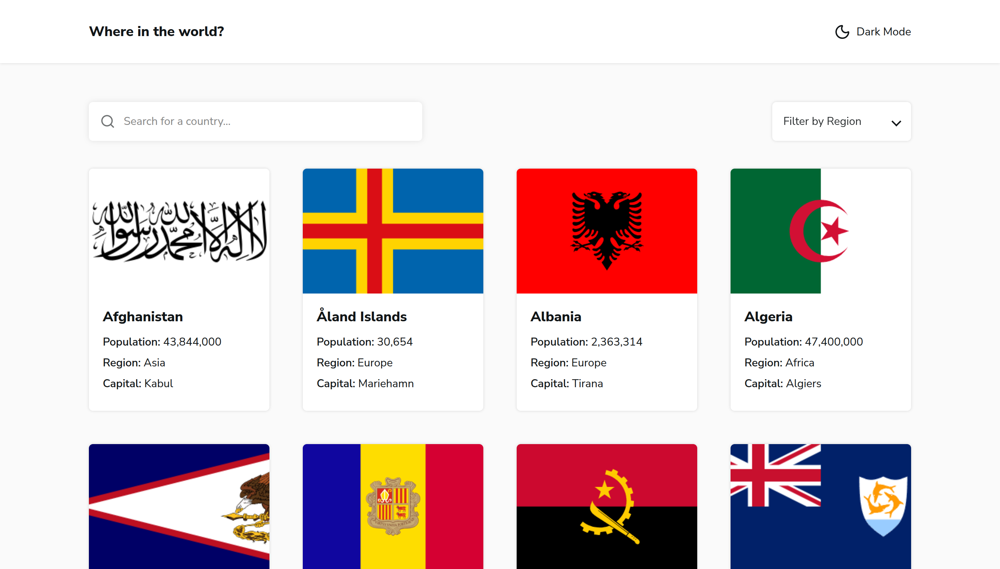

# 🌍 REST Countries API with Color Theme Switcher - Frontend Mentor

A responsive web app that lets users explore information about countries around the world — complete with dark/light mode, dynamic routing, and real-time filtering.

Built with React, designed from the original Frontend Mentor design, and developed with a focus on clean architecture, accessibility, and scalability.

## Table of contents

- [Overview](#overview)
  - [Screenshot](#screenshot)
  - [Links](#links)
- [My process](#my-process)
  - [Built with](#built-with)
  - [Features](#features)
  - [What I learned](#what-i-learned)
  - [How to Run Locally](#how-to-run-locally)
  - [Future Improvements](#future-improvements)
  - [Useful resources](#useful-resources)
- [Author](#author)
- [Acknowledgments](#acknowledgments)

## Overview

Users can:

- 🌍 View all countries and their details from the REST Countries API.

- 🔍 Search for a country by name.

- 🌎 Filter countries by region.

- 🗺️ View detailed information about a selected country.

- 🔄 Navigate to neighboring (border) countries.

- 🌗 Toggle between light and dark themes (stored in localStorage).

### Screenshot



## Live Demo

🔗 - Solution URL: [Frontend Mentor Challenge](https://www.frontendmentor.io/solutions/countries-explorer-react-rest-api-and-dark-mode-0I_6hT1ojy)

💻 - Live Site URL: [Vercel](https://rest-countries-api-with-color-theme-topaz.vercel.app/)

## 🧩 My process

### ⚙️ Built With

- ⚛️ React (Vite)

- 🎨 CSS with BEM methodology

- 🌗 Design tokens for color, spacing, and typography

- 🧠 React Context API for theme state management

- 🧭 React Router v6 for navigation

- 💾 REST Countries API v3.1

- 🪄 Custom Hooks for fetching and filtering data

- 📱 Mobile-first, responsive design

### Features

- Dark / Light Mode — toggles instantly and remembers preference.

- Search & Filter — real-time filtering with useMemo for performance.

- Responsive Grid — adapts smoothly from mobile to desktop.

- Dynamic Country Details — fetched via route params (/country/:code).

- Border Country Navigation — explore related countries with one click.

- Skeleton Loaders — smooth loading feedback for better UX.

### What I Learned

This project helped me think more like a frontend architect:

- How to structure a scalable React project with room for future features.

- The importance of semantic tokens for theming consistency.

- Managing derived state efficiently (filtered + searched countries).

- Writing clean, reusable, and accessible components.

### How to Run Locally

```bash
# Clone the repository
git clone https://github.com/BirukL137/Rest-countries-api-with-color-theme-switcher.git

cd Rest-countries-api-with-color-theme-switcher

# Install dependencies
npm install

# Start development server
npm run dev
```

### Future Improvements

If I revisit this project, I’d like to:

- Add search suggestions / auto-complete.

- Cache API results with React Query or Zustand.

- Implement unit tests using Jest + React Testing Library.

- Include animations when toggling themes or filtering.

### Useful resources

- [REST Countries API](https://restcountries.com/) - Helpful for understanding the structure of the API responses, especially nested fields like currencies, languages, and nativeName.
- [Frontend Mentor Challenge Page](https://www.frontendmentor.io/challenges/rest-countries-api-with-color-theme-switcher-5cacc469fec04111f7b848ca) - Contains the design files, requirements, and style references.
- [React Router v6 Documentation](https://reactrouter.com/en/main/start/tutorial) - I used this for handling dynamic routing (/country/:id), navigation, and linking border countries. 

## Author

- Frontend Mentor - [@BirukL137](https://www.frontendmentor.io/profile/BirukL137)
- GitHub - [@BirukL137](https://github.com/BirukL137/Rest-countries-api-with-color-theme-switcher)

## Acknowledgments

Thanks to Frontend Mentor for providing the challenge and original design.

Special thanks to the open-source community for keeping frontend development creative and evolving.